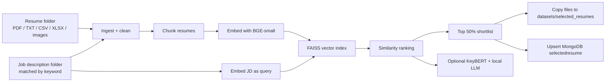

# RAG-MLOps: Intelligent Resume Screening

**Rank a pile of resumes against a job description — semantically, not with keyword bingo.**

Recruiters still spend hours skimming PDFs, Word files, screenshots, and spreadsheets looking for “someone who looks like a Data Scientist.” This project turns that grind into a **Retrieval-Augmented Generation (RAG)** pipeline: ingest mixed resume formats, embed them, compare them to a job description in vector space, keep the top matches, and persist the shortlist.

> A production-shaped FastAPI service with preprocessing, FAISS retrieval, MongoDB persistence, structured logging, and GitHub Actions CI — not a notebook demo.

---

## The problem it solves

Hiring teams do not fail because they lack resumes. They fail because **volume + format chaos + keyword search** is a terrible filter.

| Pain | What actually happens | What this system does |
| --- | --- | --- |
| Too many applicants | Hundreds of files per role | Scores every resume against the JD in one API call |
| Format chaos | PDF, TXT, CSV, Excel, even images of CVs | OCR + parsers so scanned pages still enter the index |
| Keyword ATS miss | “PyTorch” vs “deep learning frameworks” | Dense embeddings (`BAAI/bge-small-en`) match meaning |
| No audit trail | Shortlists live in someone’s inbox | Top matches copied to disk **and** stored in MongoDB |
| Hard to operate | Scripts that only run on one laptop | FastAPI + healthcheck + GitHub Actions smoke test |

The output is not “an LLM essay about hiring.” It is a **ranked shortlist with similarity scores** — something a recruiter can act on.

---

## How it works



1. **Ingest** — `POST /api/staging/` receives resume path, JD folder, a keyword (to pick the right JD file), and an optional query.
2. **Normalize** — text is cleaned (noise, bullets, contact-field clutter). Images go through **EasyOCR**.
3. **Chunk** — LangChain `RecursiveCharacterTextSplitter` keeps long CVs searchable without dumping an entire file into one vector.
4. **Retrieve** — HuggingFace **BAAI/bge-small-en** embeddings + **FAISS**. The job description is the query; every resume chunk is a candidate.
5. **Select** — unique resumes are ranked by similarity. The **top 50%** are copied to `datasets/selected_resumes/top50%` and written to MongoDB (`resumeparser.selectedresume`).
6. **Explain (optional)** — KeyBERT can pull salient phrases from the best chunks; `llm_query.py` can answer a recruiter question with a local **Ollama** model (DeepSeek-R1 distill) using the standard LangChain RAG prompt.

---

## What you get as a recruiter (or demo viewer)

Give it a folder of resumes and a job description named something like `Data Scientist.txt`.

You get back:

- Ranked `(filename, similarity_score)` pairs
- A physical shortlist folder of the winning files
- A MongoDB document keyed by folder path (upserted, so re-runs replace the previous set)

That is the “wow”: **from messy documents to a scored shortlist in one request**, with the same path a real service would use (API → pipeline → store).

---

## Architecture

```
ragmlops/
├── main.py                      # Uvicorn entry (host/port from config)
├── servers/app.py               # FastAPI app + routers
├── routes/
│   ├── healthcheck.py           # GET /healthcheck
│   └── post_user_input.py       # POST /api/staging/  — full pipeline
├── models/resumeFile.py         # Request schema
├── preprocessing/datapreprocess.py
│                                # Multi-format loaders, OCR, cleaning, KeyBERT
├── ragprocess/
│   ├── text_splitting.py        # Chunking
│   ├── embed_vectorstore.py     # BGE embeddings + FAISS search
│   └── llm_query.py             # Local Ollama RAG generation
├── database/connectDB.py        # MongoDB shortlist persistence + file copy
├── config/config.json           # Mongo URI, API host/port
├── logger/logger.py             # Console + app.log
├── datasets/job_description/    # Sample JD
└── .github/workflows/ci-cd-rag.yml
```

**API contract** (`ResumeFile`):

| Field | Role |
| --- | --- |
| `Resume_filepath` | File or folder of candidate documents |
| `Jobdesc_filepath` | Folder of job descriptions |
| `Keyword` | Filename match to pick the JD (e.g. `"Data scientist"`) |
| `Query` | Recruiter question for the optional LLM step |

---

## Tech stack

| Layer | Choice | Why it is here |
| --- | --- | --- |
| API | FastAPI + Uvicorn + Pydantic | Typed request body, `/docs` out of the box |
| Parsing | PyMuPDF, Docx loader, pandas, EasyOCR | Real resumes are not all `.txt` |
| NLP | NLTK, KeyBERT | Cleaning + keyword highlights |
| Embeddings | `BAAI/bge-small-en` (sentence-transformers) | Strong English retrieval without a huge GPU |
| Vector search | FAISS | Fast in-process similarity |
| Orchestration | LangChain | Splitters, HuggingFace embeddings, RAG prompt hub |
| Local LLM | Ollama + DeepSeek-R1 distill | Generation without sending CVs to a cloud API |
| Store | MongoDB | Shortlist as a queryable document |
| Ops | Structured logging, GitHub Actions, MLflow (in the environment) | Treat screening as a service, not a one-off script |

---

## Quick start

**Prerequisites:** Python 3.12, [MongoDB](https://www.mongodb.com/) on `localhost:27017`, and (optional) [Ollama](https://ollama.com/) if you want generation.

```bash
git clone https://github.com/selvarajpownu/ragmlops.git
cd ragmlops
python -m venv .venv
# Windows: .venv\Scripts\activate
pip install -r requirements.txt
```

Confirm `config/config.json` points at your MongoDB and API port (`127.0.0.1:8000` by default).

```bash
python main.py
```

- Swagger UI: [http://127.0.0.1:8000/docs](http://127.0.0.1:8000/docs)
- Health: `GET /healthcheck`

**Example request**

```http
POST /api/staging/
Content-Type: application/json
```

```json
{
  "Resume_filepath": "datasets/resume_files/",
  "Jobdesc_filepath": "datasets/job_description/",
  "Keyword": "Data scientist",
  "Query": "summarize the resume"
}
```

Response shape: `{ "Response": [ ["resume.pdf", 0.42], ... ] }` — filenames with similarity scores. Matching files for the top band are also copied under `datasets/selected_resumes/`.

---

## MLOps, not just RAG

This repo is named **ragmlops** because the retrieval pipeline is wrapped like something you can ship:

- **Config-driven runtime** — host, port, and Mongo URI live in `config/config.json`, not scattered constants.
- **Health endpoint** — CI and load balancers can ask “is the API up?” without running a full screen.
- **Persistence** — shortlists are upserted; empty results can drop the previous set so the DB does not lie.
- **Logging** — timestamps to stdout and `app.log` for debugging ingest/embed failures.
- **CI** — [`.github/workflows/ci-cd-rag.yml`](.github/workflows/ci-cd-rag.yml) spins MongoDB, installs deps, starts Uvicorn, waits for `/docs`, then hits `/api/staging/` with a real payload.

That is the difference between a retrieval notebook and a **screening service**.

---

## Design choices (the interesting bits)

- **JD as the query, resumes as the corpus.** Screening is “which documents are nearest to this role?”, not “chat with my PDFs.”
- **Chunk-level search, resume-level ranking.** FAISS scores chunks; the API de-duplicates by `file_name` so a long CV is not rewarded three times for the same person.
- **Percentile shortlist, not a magic threshold.** Top **50%** of the batch is selected (`n = max(1, 0.5 * total_files)`), which adapts to small and large folders.
- **Local-first generation.** When the LLM path is enabled, context stays on-box via Ollama — important when resumes are PII.
- **OCR is first-class.** A photographed CV is still a candidate, not a skipped file.

---

## API reference

| Method | Path | Purpose |
| --- | --- | --- |
| `GET` | `/healthcheck` | Liveness: `{ "Status": 200, "Message": "Health check test passed" }` |
| `POST` | `/api/staging/` | Run ingest → embed → rank → persist |

On unhandled failures the staging route returns HTTP 200 with `{ "status": 500, "Error": "Internal Server Error" }` (check `app.log`).

---

## Supported inputs

| Type | Loader |
| --- | --- |
| `.pdf` | PyMuPDF |
| `.txt` | Direct read + clean |
| `.csv` / `.xlsx` | pandas → text |
| `.jpg` / `.jpeg` / `.png` | EasyOCR (English) |

A **file or a folder** is accepted for resumes. Job descriptions are selected from a folder by **keyword in the filename**.

---

## Status

Built as an end-to-end RAG + ops pipeline for resume–JD matching. The retrieval, ranking, file export, and MongoDB path are the core product. LLM generation is implemented in `ragprocess/llm_query.py` for the next step: turning a shortlist into a recruiter-facing summary.

---

## Author

**Selvaraj P** — [github.com/selvarajpownu/ragmlops](https://github.com/selvarajpownu/ragmlops)
